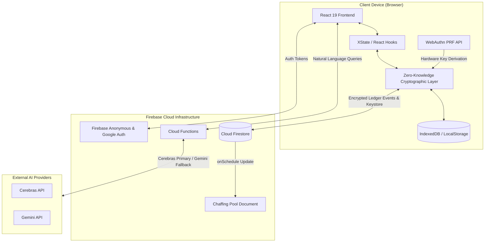

# LetUsMeet 📅

LetUsMeet is a real-time, client-side encrypted meeting poll application built with Vite, React 19, and Firebase. The system implements a zero-knowledge security model where all scheduling metadata, poll contents, and participant responses are encrypted on the client before being sent to Firestore. 

---

## 🛠️ System Architecture



---

## 🔐 Cryptographic Specification

The application operates under a client-side zero-knowledge model to ensure data confidentiality.

### 1. WebAuthn PRF Key Derivation
To secure the user keystore without relying on cloud-stored master passwords:
* The system utilizes the **WebAuthn Pseudo-Random Function (PRF) extension** during hardware authentication (e.g., Touch ID, Face ID, Windows Hello).
* The PRF output generates a high-entropy 256-bit seed, which is imported into the browser's Web Crypto API to derive a **Master Keystore Key (MKK)** (AES-GCM 256-bit).
* The MKK is used to encrypt and decrypt the user's remote Firestore keystore, which holds the keys for individual polls. The raw MKK remains solely in the client’s volatile memory and is cached locally inside a secure IndexedDB instance.

### 2. Asymmetric Recovery Phrase (AIRK Scheme)
For multi-device synchronization and credential recovery:
* **Key Generation**: A random **RSA-OAEP 2048-bit key pair** (the Asymmetric Identity Recovery Key, or AIRK) is generated on the client. A 24-word BIP39 mnemonic recovery phrase is created.
* **Protector Derivation**: The client derives an AES-GCM 256-bit key from the recovery phrase using **PBKDF2-SHA256** with a fresh random per-record salt and the OWASP-recommended work factor (currently **600,000 iterations**, exported as `PBKDF2_ITERATIONS` in `charproof`). The salt and iteration count are persisted alongside each record so the protector can be re-derived. Legacy recovery records created before random salts were introduced are still readable via a backward-compatibility path (constant salt `LetUsMeet-Recovery-Salt-v1`, 100,000 iterations).
* **Sealing**: The RSA Private Key (exported in PKCS#8 format) is encrypted using the derived protector key. The RSA Public Key is stored as plaintext inside the `recoveryMethods` map of the user’s `account_keys/default` document in Firestore, alongside the encrypted private key payload.
* **AMK Encryption**: The active **Account Master Key (AMK)** is encrypted using the RSA Public Key and saved under the recovery keyring.
* **Recovery**: Upon entering the 24-word phrase, the client reconstructs the protector key, decrypts the RSA Private Key, and unwraps the AMK to restore access to the keystore.

### 3. P2P Device Enrollment & Key Exchange
To securely add a new device to an existing account without sharing raw private keys:
1. **Request**: The new device generates a local device key pair (RSA-OAEP 2048-bit) and writes an authorization request containing its public key to `users/{uid}/pending_devices/{deviceId}`.
2. **Approval**: An already authorized device listens to the `pending_devices` collection, reads the public key, encrypts the current **AMK** using the new device's public key, updates the remote `account_keys/default` document, and deletes the pending request.
3. **Decryption**: The new device detects the updated keyring, decrypts the AMK using its local private key, and gains access to the user keystore.

### 4. Append-Only Blind Event Ledger
Poll progression is recorded using an append-only event-sourcing ledger:
* **Metadata Shell**: The root `polls/{pollId}` document contains only public, structural metadata.
* **Encrypted Event Stream**: Actions (such as creating a poll, modifying schedules, and casting votes) are formatted as JSON payloads, signed by the organizer's or participant's cryptographic key, symmetrically encrypted on the client (AES-GCM), and appended to `polls/{pollId}/events/{eventId}`.
* **Integrity Validation**: Clients subscribe to the event collection, fetch the encrypted stream, decrypt the payloads using the shared poll key, and verify signatures before executing a deterministic local reducer (`pollReducer.ts`) to compute the final state.

---

## 💾 Database Schema & Access Rules

The application enforces strict data isolation using Firestore Security Rules (`firestore.rules`):

| Path | Access Controls | Schema Requirements |
| :--- | :--- | :--- |
| `users/{userId}` | Read/Write if `request.auth.uid == userId` | User profile data |
| `users/{userId}/keystore/{entryId}` | Read/Write/Delete if `request.auth.uid == userId` | Requires `encryptedData`, `iv`, `amkId` (or specialized identity/MKK fields) |
| `users/{userId}/account_keys/default` | Read/Write/Delete if `request.auth.uid == userId` | Must contain `activeAmkId`, `devices`, and `keyring` |
| `users/{userId}/pending_devices/{deviceId}` | Read/Write if `request.auth.uid == userId` | P2P device authorization requests |
| `polls/{pollId}` | Get: open access<br>List: denied<br>Create: allowed | Read structural metadata. Direct enumeration is blocked. |
| `polls/{pollId}/events/{eventId}` | Read/Create if schema is valid<br>Update/Delete: denied | Append-only. Requires `eventId`, `createdAt` (matching server time), `encryptedData`, and `iv` |
| `chaff_pool/{docId}` | Read: open access<br>Write: denied | Updated by system cloud scheduler |

---

## 🤖 Natural Language AI Slot Extraction

LetUsMeet offers a natural language parser to extract scheduling blocks from queries like *"next Tuesday after 2pm, except Friday"*:
* **Cloud Functions Routing**: Handled by Firebase v2 Callable Functions (`extractTimeSlots` and `extractFuzzySlots`).
* **AI Provider Hierarchy**: Built on a dual-provider router (`functions/src/ai/router.ts`). The provider names and model identifiers are read from the `LETUSMEET_CONFIG` secret; the in-code defaults are:
  * **Primary**: Cerebras API utilizing `gpt-oss-120b`.
  * **Fallback**: Google Gemini API utilizing `gemma-4-26b-a4b-it` when Cerebras fails (the router retries the primary once, then falls back).
* **Structured Output Validation**: Prompts enforce date math calculations relative to the current UTC timestamp and require the model to output a strict JSON schema containing a step-by-step logic field (`reasoning`) and the normalized slot array (`time_slots`).

---

## 🛡️ Security & Privacy Mitigation

### Account Deletion & Data Destruction (Cryptographic Shredding)
* Implemented via a Firebase Cloud Function (`deleteUserAccount`).
* Upon request, the function recursively purges all documents inside `users/{uid}`—effectively deleting all stored zero-knowledge keys and device records—before deleting the underlying Firebase Authentication account.

### Traffic Analysis Mitigation (Chaffing Queries)
* **Problem**: Passive eavesdroppers observing Firestore network connections could deduce poll activity by watching document update frequencies.
* **Solution**: A scheduled Cloud Function (`refreshChaffPool`) executes every 15 minutes to aggregate, shuffle, and publish a pool of 50 active poll IDs into `chaff_pool/current`. Client browsers periodically poll and request documents from this public chaff pool to generate randomized traffic noise, masking actual user read/write signatures.

---

## 💻 Setup & Development

### Prerequisites
* **Node.js**: v22 (configured in `.nvmrc`)
* **Docker**: Required to run Playwright testing containers.

### Setup Instructions
1. Install workspace dependencies:
   ```bash
   npm install
   ```
2. Build the workspaces (`frontend` then `functions`):
   ```bash
   npm run build
   ```
   The zero-knowledge library is the published `charproof` npm package and is
   installed by `npm install`, not built from this repo.

### Running Locally
Run the concurrent dev environment (starts Vite and the Firebase Emulators Suite for Auth, Firestore, Functions, Hosting, and Pub/Sub):
```bash
npm run dev
```

To run with persistent emulator databases (saves Firestore data to `./firebase-data` on exit):
```bash
npm run dev-persistent
```

To clear saved emulator data:
```bash
npm run clear-persistent
```

**Local Ports** (see `frontend/vite.config.ts` and `firebase.json`):
* **Frontend Application (Vite dev server)**: [http://localhost:5273](http://localhost:5273) — the dev script runs `vite --host localhost`. Use the `localhost` host, **not** `127.0.0.1`: WebAuthn/passkey enrollment rejects bare IP addresses as an invalid relying-party domain, so poll creation fails on the IP host.
* **Firebase Emulator UI**: [http://localhost:4000](http://localhost:4000)
* Other emulators: Auth `9099`, Firestore `8081`, Functions `5001`, Hosting `5270`, Pub/Sub `8085`.

---

## 🧪 Testing

The codebase implements isolated unit testing and end-to-end (E2E) integration testing.

Always invoke tests through the `npm test` / `npm run test:*` scripts (see `.agents/rules/testing.md`); do not call `vitest`/`playwright` directly.

```bash
# Full sequence: build the frontend, run Vitest unit tests, then run the
# Chromium + Firefox Playwright E2E suites (see test:e2e in package.json).
npm test

# Build the frontend and run Vitest unit tests only (no E2E)
npm run test:unit

# Generate unit-test coverage
npm run test:coverage

# Run the Playwright E2E suite against locally-running emulators (no Docker)
npm run test:e2e:local
```

> The zero-knowledge crypto lives in the published `charproof` npm package, so it
> is installed (not built) by `npm install`; only `frontend/` and `functions/`
> are built locally.

### Containerized E2E Tests (Playwright inside Docker)
To avoid environmental drift in browser rendering and OS-level dependencies, E2E tests run within isolated Docker containers:
```bash
# Run E2E tests in Chromium container
npm run test:e2e:chromium

# Run E2E tests in Firefox container
npm run test:e2e:firefox

# Run E2E tests in WebKit (Safari) container
npm run test:e2e:webkit
```

---

## 🎖️ Credits & Attribution

This system leverages several open-source technologies, specifications, and cryptographic standards:

### 1. Cryptographic & Protocol Standards
* **WebAuthn PRF Extension**: W3C Web Authentication specification defining Pseudo-Random Functions for symmetric key derivation from hardware authenticators.
* **BIP39 (Bitcoin Improvement Proposal 39)**: Standard protocol for generating high-entropy seeds from a 24-word human-readable mnemonic phrase.

### 2. Open Source Libraries
* **bip39**: JavaScript implementation of the BIP39 mnemonic standard for Node.js and browsers.
* **XState / @xstate/test**: Finite state machine library for UI routing orchestration, reactive flow control, and automated model-based E2E sequence testing.
* **Lucide React**: Modular React wrapper for the open-source Lucide vector icon suite.
* **Vite & React 19**: Modern bundler tooling and core rendering library for dynamic user interfaces.
* **Tailwind CSS**: Utility-first styling architecture.

### 3. Backend & Infrastructure Components
* **Firebase Platform**: Provides Anonymous & Google Authentication, real-time Cloud Firestore, Cloud Functions, and the Local Emulator Suite.
* **Cerebras Inference API**: High-throughput natural language completion engine (`gpt-oss-120b`).
* **Google Gemini API**: Native language tokenizer and processing engine (`gemma-4-26b-a4b-it`).