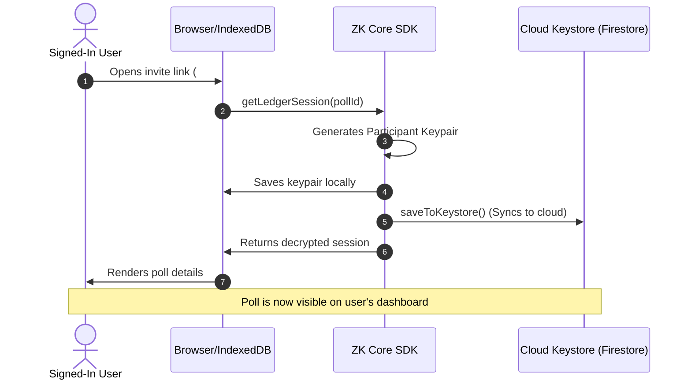
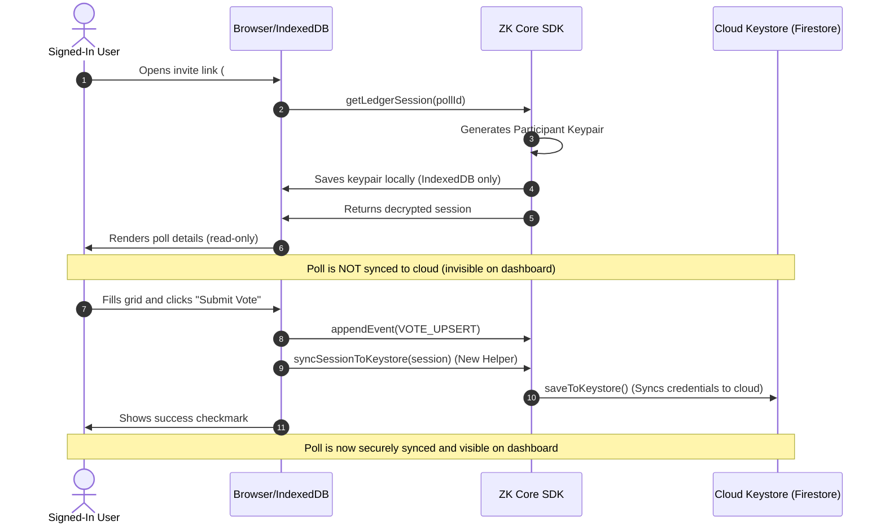

# Feasibility & Architectural Proposal: Lazy Poll Joining (Join-on-Vote)

This proposal analyzes the architectural feasibility, cryptographic implications, and user experience tradeoffs of transitioning the LetUsMeet platform from a **Join-on-Load** model to a **Lazy Joining (Join-on-Vote)** model.

---

## 1. Executive Summary

Currently, when a authenticated user simply clicks an invite link and loads a poll, the system immediately generates a cryptographic identity and registers the poll in their cloud-synced keystore (**Join-on-Load**). This populates their dashboard with every poll they have ever viewed, regardless of active participation.

Under the **Lazy Joining (Join-on-Vote)** model:
1. **Viewing remains completely read-only and local**: Loading a poll generates a local identity in IndexedDB to decrypt the ledger, but does *not* upload credentials to the cloud keystore.
2. **Joining is triggered by action**: The poll is securely synced to the cloud keystore *only* when the user submits their vote (`VOTE_UPSERT`).

> [!NOTE]
> This analysis confirms that the proposed Lazy Joining model is **100% architecturally feasible** and requires no major database schema modifications, only clean shifts in event triggers within the ZK Core SDK and the frontend.

---

## 2. Current vs. Proposed Workflows

### Current Model: Join-on-Load


### Proposed Model: Lazy Joining (Join-on-Vote)


---

## 3. Feasibility & Cryptographic Analysis

### 1. Read-Only Decryption
* **Is it possible to decrypt without joining?** Yes. To decrypt a poll's ledger, the client only needs the symmetric key (`shareableKey`) from the URL fragment and a local signing identity to establish the reader context. There is **no database write requirement** to view a poll.
* **IndexedDB role**: Storing the keypair locally in IndexedDB remains necessary to remember the user's identity across page refreshes before they vote, preventing identity fragmentation.

### 2. Zero-Knowledge Privacy
* **Keystore isolation**: The blind Firestore keystore remains zero-knowledge. Delaying the upload of the `LedgerCredentials` payload does not alter the encryption schema—it simply postpones when the blinded payload is sent.
* **Privacy Enhancement**: Lazy joining actually **improves user privacy**. If a user decides *not* to vote after viewing a poll, no metadata trace (not even an encrypted ledger mapping) is written to their Firestore user document.

### 3. Edge-Case: What if they delete local IndexedDB before voting?
* If a user loads the page, does not vote, clears their browser cache (or uses incognito), and visits again, a new participant keypair will be generated. Since they never voted, this "abandoned" identity leaves no ghost entries anywhere.

---

## 4. Step-by-Step Implementation Plan

### Step 1: Add a Keystore Sync Method to `session.ts`
We export a clean utility function to sync a running ledger session to the cloud keystore on demand:

```typescript
export async function syncSessionToKeystore(session: LedgerSession): Promise<void> {
  const user = auth.getCurrentUser();
  if (user && !user.isAnonymous) {
    const creds: LedgerCredentials = {
      symmetricKey: session.exportSessionKey(),
      signingPrivateKey: (session as any).signingPrivateKeyB64, // We will expose this
      signingPublicKey: session.getSignerPublicKey()
    };
    await saveToKeystore(session.ledgerId, creds);
  }
}
```

### Step 2: Remove Auto-Sync from `getLedgerSession`
We modify Step 4 (New Participant) in `getLedgerSession` to **only write to local storage (IndexedDB)**:

```diff
  // 4. New participant
  if (options?.shareableKey) {
    const keyPair = await generateIdentityKeyPair();
    const privB64 = await exportPrivateKey(keyPair.privateKey);
    const pubB64 = await exportPublicKey(keyPair.publicKey);

    await local.saveIdentity(ledgerId, { privateKey: privB64, publicKey: pubB64 });

-   if (user && !user.isAnonymous) {
-     const creds: LedgerCredentials = {
-       symmetricKey: options.shareableKey,
-       signingPrivateKey: privB64,
-       signingPublicKey: pubB64
-     };
-     await saveToKeystore(ledgerId, creds);
-   }

    return new DefaultLedgerSession(...);
  }
```

### Step 3: Remove Auto-Sync from Step 2 of `getLedgerSession`
We revert our race-condition sync safety net from `getLedgerSession`'s Step 2 so that viewing a previously visited (but unvoted) poll does not trigger a cloud upload.

### Step 4: Trigger Sync on Vote Submission
In `VotePollPage.tsx`, inside the `handleSubmit` routine:

```typescript
    try {
      setIsSubmitting(true);
      const action: PollAction = {
        type: "VOTE_UPSERT",
        payload: {
          participantName: name.trim(),
          email: email.trim() || undefined,
          selections,
          clientTimestamp: Date.now()
        }
      };

      // 1. Submit the vote to the ledger
      await session.appendEvent(action);

      // 2. Securely sync to the user's cloud keystore to list on dashboard
      await syncSessionToKeystore(session);

      setHasVoted(true);
    } catch (err) {
      alert("Failed to submit vote");
    }
```

---

## 5. User Experience (UX) Tradeoffs

| Category | Join-on-Load (Current) | Lazy Joining (Proposed) |
| :--- | :--- | :--- |
| **Dashboard Cleanliness** | ⚠️ Can become cluttered with abandoned or clicked polls. |  **Perfect.** Only polls the user actively participates in or organizes appear. |
| **Privacy Footprint** | Low (Blind payloads), but leaves encrypted documents on Firestore. | **None.** Absolutely zero server-side record exists if the user only views a poll. |
| **Save-for-Later** |  Allows users to easily find a poll they viewed but haven't voted in yet. | ⚠️ User must bookmark or keep the invite link until they vote. |

---

## 6. Recommendation

The **Lazy Joining** model is highly recommended for applications prioritizing high-signal dashboards. 

If we want the absolute best of both worlds, we can add a **"Save to Dashboard" bookmark icon** next to the poll title on the `VotePollPage` for logged-in users. This allows them to manually bookmark a poll to their dashboard without voting, while keeping the default behavior clean (only syncing on active vote submission).
