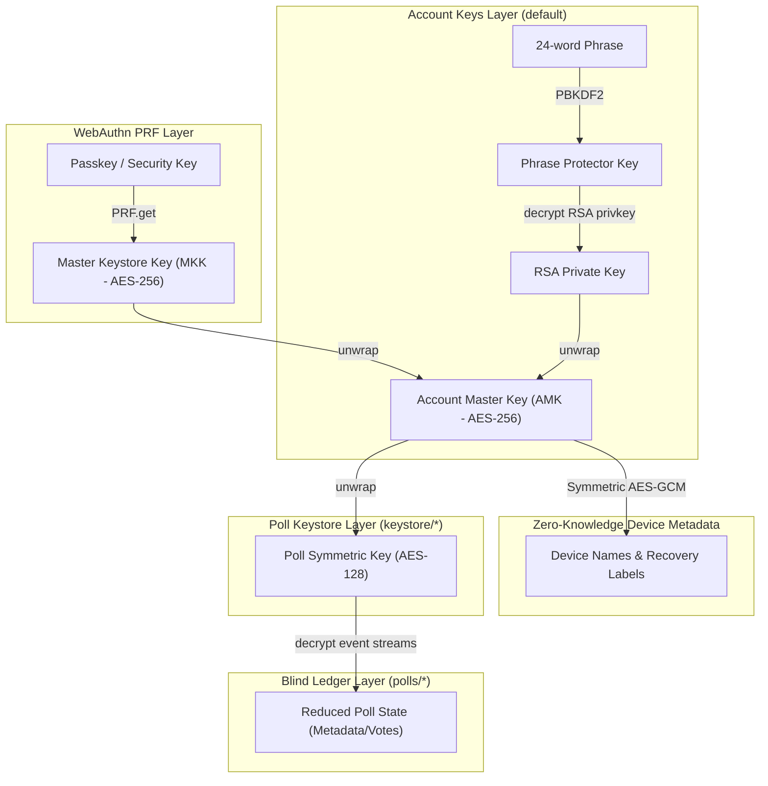

# LetUsMeet: Zero-Knowledge Architecture Specification

**Status:** Finalized & Implemented
**Scope:** Comprehensive documentation of the zero-knowledge event sourcing model, multi-device cryptographic keyrings, Level 3R recovery, and client-side reduction.

---

## 1. Architectural Paradigm Shift

LetUsMeet operates on a **Zero-Knowledge, Append-Only Event Sourcing** model. The backend database (Firestore) is mathematically blind and enforces zero business logic. It merely acts as a chronological message broker for ciphertext. The React frontend is the absolute source of truth and the primary security enforcer.

**Core Invariants:**
1. **Cryptography over Authentication**: Firebase Auth is only used to gate access to the user's keystore. Identity and ownership within a poll are proven entirely through client-side ECDSA signatures.
2. **Server Blindness**: A Firebase Cloud Function or server must never process or possess plaintext keys. All key rotation, wrapping, and metadata decryption happen client-side in the browser.
3. **Event Sourcing**: The state of a poll is not stored in the database. Instead, the database stores a sequential log of encrypted events.
4. **Device Metadata Privacy**: All device names and recovery labels are classified as PII and are symmetrically encrypted.

---

## 2. Cryptographic Key Hierarchy

To ensure a true zero-knowledge model with multi-device synchronization and robust recovery, the application implements a multi-tiered key hierarchy:



### 2.1 The Keys

1. **Poll Keys (Level 1)**: 
   - **Symmetric Poll Key**: AES-GCM 128-bit key stored in the URL fragment (`#key=...`). Encrypts the poll ledger events.
   - **Identity Key Pair**: ECDSA P-256 key pair. Proves ownership of ledger actions. Stored in the keystore.
   - *These keys never rotate.*
2. **Account Master Key / AMK (Level 2)**: 
   - AES-GCM 256-bit symmetric key.
   - Encrypts all poll symmetric keys inside the `keystore` collection.
   - Encrypts authorized device metadata and recovery labels.
   - *Rotates automatically upon device revocation.*
3. **Key Encrypting Keys / KEKs (Level 3)**:
   - **Devices (Level 3D)**: Asymmetric RSA-OAEP 2048-bit key pairs generated for each browser. Public key stored in Firestore; private key held in IndexedDB.
   - **Recovery Methods (Level 3R)**: A set of recovery paths (WebAuthn PRF keys or Phrase-derived RSA-OAEP keys) registered to unwrap the AMK.

---

## 3. Data Model & Firestore Security Rules

Because Firestore is blind to business logic, security rules enforce shape validation, isolation, and chronological immutability.

### 3.1 Device & Recovery Management Schema (`users/{userId}/account_keys/default`)

```typescript
export interface DevicePublicKey {
  deviceId: string;
  publicKey: string;                  // Base64 RSA SPKI public key
  encryptedDeviceName: EncryptedData; // Symmetrically encrypted under active AMK
  createdAt: number;
}

export interface RecoveryMethod {
  type: 'prf' | 'phrase';
  encryptedLabel: EncryptedData;      // Symmetrically encrypted under active AMK
  publicKey: string;                  // Base64 public key (RSA or PRF seed)
  createdAt: number;
}

export interface AccountKeysDocument {
  activeAmkId: string;
  devices: Record<string, DevicePublicKey>;
  recoveryMethods: Record<string, RecoveryMethod>;
  keyring: Record<string, Record<string, string>>; // amkId -> (deviceId/methodId) -> Wrapped AMK
}
```

### 3.2 The Keystore & Blind Ledger

```typescript
export interface KeystoreEntry extends EncryptedData {
  pollId: string;
  updatedAt: number;
  amkId: string; // The AMK ID used to encrypt this entry
}

export interface BlindEvent {
  eventId: string;
  createdAt: number;     // FieldValue.serverTimestamp()
  encryptedData: string; // AES-GCM Ciphertext (Base64)
  iv: string;            // AES-GCM IV (Base64)
}
```

### 3.3 Security Rules

- **Keystore (`users/{userId}/keystore/{entryId}`)**: Strictly isolated per authenticated user. Must match `KeystoreEntry` shape.
- **Account Keys (`users/{userId}/account_keys/default`)**: Only writable by the owner.
- **Blind Ledger (`polls/{pollId}/events/{eventId}`)**: Append-only invariant. Anyone can read. Creates require `createdAt == request.time`. Updates and deletes are forbidden.

---

## 4. Core Workflows: Multi-Device Authorization & Rotation

### Flow A: Initial Setup (Genesis Device)
1. Generate `device_key_pair` (RSA-OAEP) and ECDSA identity keys. Save Private Key securely to IndexedDB.
2. Generate `amk_v1` (AES-GCM 256-bit).
3. Wrap `amk_v1` using the `device_key_pair.publicKey`.
4. Symmetrically encrypt the device name under the AMK.
5. Derive WebAuthn PRF Master Key (MKK) or Recovery Phrase. Symmetrically wrap the AMK.
6. Write the default keyring, device map, recovery method records, and wrapped AMK to Firestore.

### Flow B: P2P Multi-Device Authorization
*Requires an online authorized device (sponsor) to complete key exchange.*
1. **Pending Device**: Generates new RSA-OAEP key pair, saves private key to IndexedDB. Generates an ephemeral AES key, encrypts its device name, and RSA-wraps the ephemeral key for all active devices. Publishes request.
2. **Sponsor Device (Transaction)**: Decrypts the pending device name using its private key, re-encrypts it using the active AMK, wraps the active AMK with the Pending Device's public key, appends it to the authorized `devices` map, and commits.

### Flow C: Device Revocation & Dynamic Rotation
1. **Key Rotation (Transaction)**:
   - Generate `newAmk`.
   - Retrieve `oldAmk`. Decrypt all remaining device names and recovery labels using `oldAmk`, then re-encrypt them using `newAmk`.
   - Wrap `newAmk` using the RSA public keys of all remaining authorized devices and recovery methods.
   - Set `activeAmkId` to `newAmkId` and commit.
2. **On-Demand Decryption (Zero Migration Overhead)**:
   - Existing poll keystore entries remain encrypted under their original AMK IDs.
   - When loading a keystore entry, the client checks `amkId`. If it's older than `activeAmkId`, the client loads that specific older AMK from the keyring (`keyring[targetAmkId][deviceId]`) using its local device private key. This avoids database-wide batch migrations.

---

## 5. Recovery Architectures (Level 3R)

To decouple recovery from physical devices, the application implements explicit Level 3R Recovery Methods.

### 5.1 Symmetric-Wrapped RSA Recovery Phrase (AIRK)
Allows "Cold Storage" persistence across AMK rotations without exposing the private recovery secret to active devices.
1. **Setup**: Generate 24-word BIP39 mnemonic. Generate random RSA-OAEP 2048-bit Key Pair. Derive AES-GCM 256-bit Protector from mnemonic (PBKDF2). Seal RSA Private Key with Protector. Register RSA Public Key in Firestore.
2. **AMK Wrapping**: Active devices wrap the AMK using the RSA Public Key.
3. **Recovery**: User inputs phrase -> Derive Protector -> Decrypt RSA Private Key -> Unwrap AMK.

### 5.2 WebAuthn PRF (Passkeys)
Uses the WebAuthn PRF extension to derive a deterministic Master Keystore Key (MKK) per credential.
- **Rotation Behavior**: If the PRF key is available in the session cache during a device revocation, the system automatically re-wraps the new AMK.

---

## 6. The Client-Side Cryptographic Reducer

The reducer evaluates events strictly in sequence.

```typescript
export interface DecryptedSignedEvent {
  publicKey: string;  // Base64 ECDSA Public Key
  signature: string;  // Base64 ECDSA Signature
  action: PollAction; // The JSON payload of the mutation
}
```

### Security Vectors & Mitigation
1. **The Sybil / Masquerade Attack**: User B constructs a `VOTE_UPSERT` with User A's name. User B lacks A's private key, so they must sign with B's key. The reducer uses B's public key for the map insertion, leaving A's vote untouched.
2. **Admin Takeover**: An attacker appends a `POLL_UPDATED` event. The reducer's `POLL_CREATED` case locks `state.adminPublicKey`. The update is dropped because `event.publicKey !== state.adminPublicKey`.
3. **Time Travel Attack**: An attacker forges the `clientTimestamp`. The reducer processes events based on Firestore's `createdAt` server timestamp. If a vote appears after a `POLL_FINALIZED` event, it is dropped.

---

## 7. Zero-Knowledge UX Architecture

Because the server cannot recover lost keys or decrypt data, the UX must aggressively guide the user.

1. **Fatal Decryption State**: If a user navigates to a poll without the `#key=` fragment, the app hard-crashes gracefully with a full-screen `<FatalDecryptionError />`.
2. **Share Link Warnings**: Copying the URL displays a stark warning: *"Anyone with this exact link can decrypt and view this poll."*
3. **PRF Educational Interstitial**: Blocks the dashboard until the user authenticates, explicitly stating that password resets are impossible.
4. **Anonymous Volatility Warning**: Unauthenticated users (keys in IndexedDB) see a persistent banner warning them that clearing browser data will result in permanent loss of edit capabilities.
5. **Honest Loading States**: Decrypting the ledger takes time. The UI exposes the pipeline: `"Fetching encrypted ledger..." -> "Verifying signatures..." -> "Decrypting data..."` rather than a generic spinner.
6. **Cryptographic Debouncing**: Voting clicks update a local `draftSelections` state instantly, but delay the heavy sign->encrypt->append pipeline by 1500ms to prevent network/crypto flooding.
