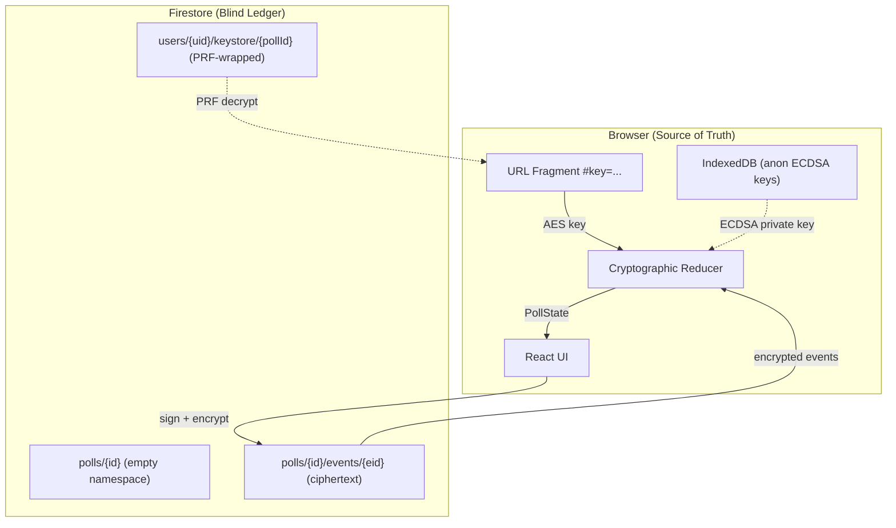
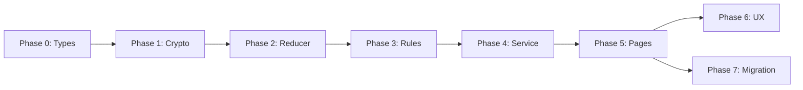

# Zero-Knowledge Pivot — Implementation Plan

> [!IMPORTANT]
> This is a **fundamental architectural rewrite**. The app moves from server-trusted CRUD to client-side cryptographic event sourcing. Nearly every file in `frontend/src/` is affected.

---

## Executive Summary

| Dimension | Current State | Target State |
|---|---|---|
| **Auth model** | Firebase Auth UID gates all writes | ECDSA key pairs prove identity; Auth only gates the Keystore |
| **Data model** | `polls/{id}` stores plaintext CRUD doc + `votes` subcollection | `polls/{id}/events/{eid}` stores AES-GCM ciphertext blobs |
| **Security rules** | Complex field-level checks, `organizerUid`, `adminToken` subcollections | Minimal append-only schema checks; client enforces business logic |
| **State derivation** | Direct Firestore reads | Client decrypts + reduces an event ledger |
| **Key management** | None | AES-GCM symmetric key (URL fragment), ECDSA per-poll identity, WebAuthn PRF master key |

---

## Architecture Diagram



---

## Phase Overview

| Phase | Name | Files Touched | Risk | Estimated Effort |
|---|---|---|---|---|
| **0** | Shared Types & Interfaces | `shared/types.ts`, `frontend/src/types/index.ts` | Low | Small |
| **1** | Crypto Primitives Module | New: `frontend/src/lib/crypto.ts` | Medium | Medium |
| **2** | Client-Side Reducer | New: `frontend/src/lib/pollReducer.ts` | High | Medium |
| **3** | Firestore Schema & Rules | `firestore.rules`, `firestore.indexes.json` | High | Small |
| **4** | Service Layer Rewrite | `frontend/src/lib/pollService.ts` | High | Large |
| **5** | Page-Level Rewiring | All pages in `frontend/src/pages/` | High | Large |
| **6** | UX Polish & Edge Cases | Multiple new components | Medium | Medium |
| **7** | Migration & Cleanup | Cleanup old code, migration script | Medium | Medium |

---

## Phase 0 — Shared Types & Interfaces

### Goal
Define all new TypeScript interfaces before writing any logic.

### New Types (add to `shared/types.ts`)

```typescript
// === FIRESTORE SCHEMA (server-visible ciphertext) ===
export interface BlindPoll {
  pollId: string;
}

export interface BlindEvent {
  eventId: string;
  createdAt: number; // serverTimestamp()
  encryptedData: string; // AES-GCM ciphertext (Base64)
  iv: string; // AES-GCM IV (Base64)
}

export interface KeystoreEntry {
  pollId: string;
  wrappedPayload: string; // PRF-encrypted ciphertext
  iv: string;
  updatedAt: number;
}

// === CLIENT-SIDE DECRYPTED SCHEMA ===
export interface DecryptedSignedEvent {
  publicKey: string;  // Base64 ECDSA SPKI
  signature: string;  // Base64 ECDSA signature
  action: PollAction;
}

export type PollAction =
  | { type: "POLL_CREATED"; payload: PollMetadata }
  | { type: "POLL_UPDATED"; payload: Partial<PollMetadata> }
  | { type: "POLL_FINALIZED"; payload: { finalizedSlotId: string } }
  | { type: "VOTE_UPSERT"; payload: VoteData }
  | { type: "VOTE_RETRACTED"; payload: null };

export interface PollMetadata {
  title: string;
  description?: string;
  location: string;
  organizerName: string;
  schedulingMode: "EXACT" | "FUZZY";
  timeSlots: TimeSlot[];
}

export interface VoteData {
  participantName: string;
  selections: Record<string, VoteValue>;
  clientTimestamp: number;
}

export interface DecryptedKeystorePayload {
  symmetricPollKey: string;
  ecdsaPrivateKey: string;
  ecdsaPublicKey: string;
}

// === REDUCER OUTPUT ===
export interface PollState {
  adminPublicKey: string | null;
  metadata: PollMetadata | null;
  votes: Map<string, VoteData>;
  isFinalized: boolean;
  finalizedSlotId?: string;
}
```

### What to keep
- `ExactTimeSlot`, `FuzzyTimeSlot`, `TimeSlot`, `VoteValue`, `SchedulingMode` — unchanged
- `Poll`, `Vote` — **delete** (replaced by `PollState`, `VoteData`, `BlindPoll`)

### Tests
- Type-only phase; validated at compile time

---

## Phase 1 — Crypto Primitives Module

### Goal
Create `frontend/src/lib/crypto.ts` — a pure module wrapping `window.crypto.subtle`.

### Functions to implement

| Function | Signature | Purpose |
|---|---|---|
| `generateSymmetricKey` | `() → Promise<CryptoKey>` | AES-GCM 128-bit, extractable |
| `exportSymmetricKey` | `(key) → Promise<string>` | Export to Base64URL (22 chars) |
| `importSymmetricKey` | `(b64url) → Promise<CryptoKey>` | Import from URL fragment |
| `encrypt` | `(key, plaintext) → Promise<{ciphertext, iv}>` | AES-GCM encrypt, random 12-byte IV |
| `decrypt` | `(key, ciphertext, iv) → Promise<string>` | AES-GCM decrypt |
| `generateIdentityKeyPair` | `() → Promise<{publicKey, privateKey}>` | ECDSA P-256 |
| `exportPublicKey` | `(key) → Promise<string>` | SPKI → Base64 |
| `exportPrivateKey` | `(key) → Promise<string>` | PKCS8 → Base64 |
| `importPublicKey` | `(b64) → Promise<CryptoKey>` | Base64 → SPKI |
| `importPrivateKey` | `(b64) → Promise<CryptoKey>` | Base64 → PKCS8 |
| `signAction` | `(privateKey, action) → Promise<string>` | Deterministic JSON → SHA-256 → ECDSA sign |
| `verifySignature` | `(publicKeyB64, signatureB64, action) → Promise<boolean>` | Verify ECDSA signature |
| `canonicalStringify` | `(obj) → string` | Deterministic JSON (sorted keys) |

### Critical constraints
- **No third-party crypto libraries** — `window.crypto.subtle` only
- `canonicalStringify` must use recursive key sorting — this is the #1 source of signature verification bugs
- Every `encrypt` call generates a fresh 12-byte IV via `crypto.getRandomValues`
- All key exports use standard Base64 except the symmetric key which uses Base64URL

### Tests (`frontend/src/lib/crypto.test.ts`)
1. Round-trip: generate → export → import → encrypt → decrypt
2. Sign → verify → tamper payload → verify fails
3. `canonicalStringify` produces identical output for reordered keys
4. Different IVs produce different ciphertexts for same plaintext
5. Wrong key fails decryption with `DOMException`

---

## Phase 2 — Client-Side Reducer

### Goal
Create `frontend/src/lib/pollReducer.ts` — the **core security engine**.

### Implementation
Exact implementation from [tdd-reducer.md](file:///Users/btsai/antigravity/LetUsMeet/plans/zero-knowledge-pivot/tdd-reducer.md) — the `calculatePollState` async function.

### Key behaviors

| Event Type | Authorization | State Mutation |
|---|---|---|
| `POLL_CREATED` | First valid event only | Sets `adminPublicKey` + `metadata` |
| `POLL_UPDATED` | `publicKey === adminPublicKey` | Merges partial metadata |
| `POLL_FINALIZED` | `publicKey === adminPublicKey` | Sets `isFinalized = true` |
| `VOTE_UPSERT` | Any valid signer (if not finalized) | `votes.set(publicKey, payload)` |
| `VOTE_RETRACTED` | Any valid signer (if not finalized) | `votes.delete(publicKey)` |

### Security vectors to test
1. **Sybil attack**: Forged event with wrong ECDSA key → dropped
2. **Admin takeover**: Non-admin `POLL_UPDATED` → dropped
3. **Time travel**: `VOTE_UPSERT` after `POLL_FINALIZED` → dropped
4. **Garbage ciphertext**: Malformed event → `try/catch` → skip (no crash)
5. **Duplicate `POLL_CREATED`**: Second genesis → ignored

### Tests (`frontend/src/lib/pollReducer.test.ts`)
- 8–10 unit tests covering each event type + each attack vector
- These tests use real `crypto.subtle` calls (JSDOM supports it with `@testing-library/jest-dom` + Node 22)

---

## Phase 3 — Firestore Schema & Rules

### Goal
Replace current complex rules with the blind append-only ledger rules.

### New `firestore.rules`

```javascript
rules_version = '2';
service cloud.firestore {
  match /databases/{database}/documents {

    // 1. KEYSTORE — only collection using Firebase Auth
    match /users/{userId}/keystore/{pollId} {
      allow read: if request.auth != null && request.auth.uid == userId;
      allow write: if request.auth != null && request.auth.uid == userId
        && request.resource.data.keys().hasAll(['pollId', 'wrappedPayload', 'iv', 'updatedAt']);
    }

    // 2. BLIND LEDGER
    match /polls/{pollId} {
      allow read: if true;
      allow create: if true;
      allow update, delete: if false;

      match /events/{eventId} {
        allow read: if true;
        allow create: if request.resource.data.keys().hasAll(['eventId', 'createdAt', 'encryptedData', 'iv'])
          && request.resource.data.createdAt == request.time;
        allow update, delete: if false;
      }
    }

    // 3. EXISTING USER PROFILE (keep for account deletion flow)
    match /users/{userId} {
      allow read, write: if request.auth != null && request.auth.uid == userId;
    }
  }
}
```

### What gets deleted
- `adminTokens` subcollection & rules
- `adminGrants` subcollection & rules
- `votes` subcollection & rules
- `private/data` subcollection & rules
- All `organizerUid` / `participantUid` field checks

### Migration note
No migration needed — we start with a **clean-slate database**. Old Firestore collections (`polls`, `votes`, `adminTokens`, `adminGrants`) are simply not created. The new rules replace the old ones entirely.

---

## Phase 4 — Service Layer Rewrite

### Goal
Rewrite `frontend/src/lib/pollService.ts` to operate on the blind ledger.

### Functions to rewrite

| Old Function | New Function | Change |
|---|---|---|
| `createPoll()` | `createBlindPoll()` | Creates empty poll doc + appends encrypted `POLL_CREATED` event |
| `submitVote()` | `appendVoteEvent()` | Signs + encrypts `VOTE_UPSERT`, appends to events subcollection |
| `updatePoll()` | `appendUpdateEvent()` | Signs + encrypts `POLL_UPDATED` event |
| `finalizePoll()` | `appendFinalizeEvent()` | Signs + encrypts `POLL_FINALIZED` event |
| `deleteVote()` | `appendRetractEvent()` | Signs + encrypts `VOTE_RETRACTED` event |
| `subscribeToPoll()` | `subscribeToLedger()` | Subscribes to `events` subcollection, decrypts + reduces on each snapshot |
| `subscribeToUserPolls()` | Reimagined via Keystore | Query `users/{uid}/keystore` for poll IDs, then fetch each ledger |
| `ensureAdminGrant()` | **Removed** | No more admin grants |
| `claimPoll()` | **Removed** | No more claiming |

### New functions

| Function | Purpose |
|---|---|
| `saveToKeystore(pollId, payload)` | PRF-encrypt keys → write to `users/{uid}/keystore/{pollId}` |
| `loadFromKeystore(pollId)` | PRF-decrypt → return `DecryptedKeystorePayload` |
| `derivePrfMasterKey(credential)` | WebAuthn PRF → AES-GCM 256-bit transient master key |
| `registerPrfCredential()` | Create WebAuthn credential with PRF extension |
| `saveToIndexedDB(pollId, ecdsaPrivateKey)` | Fallback for **anonymous Firebase Auth** users (no PRF access) |
| `loadFromIndexedDB(pollId)` | Load anon user's ECDSA private key |
| `extractKeyFromFragment()` | Parse `window.location.hash` → return AES key or null |

> [!NOTE]
> Firebase anonymous auth is **retained**. All users get a Firebase UID. The distinction is:
> - **Google-authed users** → full PRF + Keystore (cross-device sync)
> - **Anonymous Firebase Auth users** → IndexedDB only (single-device, volatile)

### Key implementation detail — `subscribeToLedger`

```typescript
export function subscribeToLedger(
  pollId: string,
  symmetricKey: CryptoKey,
  onState: (state: PollState) => void,
  onStatus: (status: string) => void
) {
  const eventsRef = collection(db, "polls", pollId, "events");
  const q = query(eventsRef, orderBy("createdAt", "asc"));

  return onSnapshot(q, async (snapshot) => {
    onStatus("Fetching encrypted ledger...");
    const decrypted: DecryptedSignedEvent[] = [];

    onStatus("Decrypting poll data...");
    for (const doc of snapshot.docs) {
      try {
        const blind = doc.data() as BlindEvent;
        const json = await decrypt(symmetricKey, blind.encryptedData, blind.iv);
        decrypted.push(JSON.parse(json));
      } catch {
        console.warn("Dropping undecryptable event:", doc.id);
      }
    }

    onStatus("Verifying cryptographic signatures...");
    const state = await calculatePollState(decrypted);
    onState(state);
  });
}
```

---

## Phase 5 — Page-Level Rewiring

### 5.1 `CreatePollPage.tsx`

**Current**: Calls `createPoll()` which writes plaintext to Firestore.

**New flow**:
1. Generate AES symmetric key
2. Generate ECDSA identity key pair
3. Construct `POLL_CREATED` action with `PollMetadata`
4. Sign with ECDSA private key
5. Encrypt signed event with AES key
6. Write `BlindPoll` doc + first `BlindEvent`
7. If authenticated: PRF-derive master key → save all keys to Keystore
8. Navigate to `/poll/{id}#key={base64url_key}`

**Key changes**:
- Remove `adminToken` generation and `localStorage` storage
- URL now includes `#key=...` fragment instead of `?adminToken=...` query param
- `organizerName` moves from plaintext poll doc → encrypted inside `POLL_CREATED` event metadata
- `organizerName` is still **displayed in the UI** after client-side decryption (confirmed decision)
- If Google-authed: immediately prompt PRF registration → save to Keystore
- If anon Firebase Auth: save ECDSA private key to IndexedDB + show volatility warning

### 5.2 `VotePollPage.tsx`

**Current**: Subscribes to poll doc + votes subcollection via `subscribeToPoll()`.

**New flow**:
1. On mount: `extractKeyFromFragment()` — if missing, render `<FatalDecryptionError />`
2. Import AES key from fragment
3. Check for existing ECDSA identity:
   - **Google-authed user** → PRF-derive master key → check `users/{uid}/keystore/{pollId}` → decrypt or generate new
   - **Anon Firebase Auth user** → check IndexedDB for `letusmeet_priv_{pollId}` → load or generate new
4. Subscribe to ledger via `subscribeToLedger()`
5. Reducer output drives UI (title, organizer name, slots, existing votes)
6. On vote submit: construct `VOTE_UPSERT`, sign, encrypt, append via `useDebouncedVote` hook
7. If anon: show `<AnonymousWarningBanner />` (dismissible, stored in `sessionStorage`)

**Major deletions**:
- All `adminToken` / `adminGrant` / `isTokenAdmin` logic (~70 lines)
- `claimPoll` banner and handler
- `subscribeToPoll` → replaced with `subscribeToLedger`
- Vote identification by `participantUid` → now by ECDSA public key
- `participantEmail` field (encrypted inside event, no separate private subcollection)

### 5.3 `EditPollPage.tsx`

**Current**: Loads poll via `subscribeToPoll()`, calls `updatePoll()`.

**New flow**:
1. Extract key from fragment
2. Load admin ECDSA identity from Keystore/IndexedDB
3. Verify local public key matches `state.adminPublicKey` — if not, show "Not authorized"
4. On save: construct `POLL_UPDATED`, sign, encrypt, append

**Major deletions**: Same as VotePollPage — all admin token/grant logic removed.

### 5.4 `ResultsPage.tsx`

**Current**: Reads poll + votes from `subscribeToPoll()`.

**New flow**:
1. Extract key from fragment
2. Subscribe to ledger
3. Render from `PollState.votes` (keyed by public key, not UID)
4. Finalize button: append `POLL_FINALIZED` event (admin only)

### 5.5 `DashboardPage.tsx`

**Current**: `subscribeToUserPolls()` queries by `organizerUid`.

**New flow** (full PRF + Keystore — v1):
1. Require Google-authed user (anon users see "Sign in to access dashboard")
2. Check if PRF master key is in `sessionStorage` memory
3. If not: transition to `SHOW_INTERSTITIAL` state → render `<PrfEducationalInterstitial />`
4. User clicks "Unlock" → `navigator.credentials.get()` with PRF extension → derive master key
5. On success: transition to `UNLOCKED` → query `users/{uid}/keystore` collection
6. For each `KeystoreEntry`: decrypt with master key → extract symmetric poll key → subscribe to ledger briefly to get title/status
7. On PRF failure / `DOMException`: render `<HardwareMismatchError />`
8. Poll cards link to `/poll/{id}#key={key}` (key embedded in link)

> [!IMPORTANT]
> The PRF master key is **ephemeral** — stored only in a module-level closure or `sessionStorage`. It is destroyed when the tab closes. It is **never** written to `localStorage` or IndexedDB.

### 5.6 `router.tsx`

No route changes needed. The `#key=` fragment is handled by each page component, not the router (fragments are invisible to React Router).

---

## Phase 6 — UX Polish & Edge Cases

### 6.1 New Components

| Component | Location | Purpose |
|---|---|---|
| `FatalDecryptionError` | `components/FatalDecryptionError.tsx` | Full-screen blocker when `#key=` missing |
| `PrfEducationalInterstitial` | `components/PrfEducationalInterstitial.tsx` | Modal before WebAuthn PRF prompt |
| `HardwareMismatchError` | `components/HardwareMismatchError.tsx` | PRF key doesn't match keystore |
| `AnonymousWarningBanner` | `components/AnonymousWarningBanner.tsx` | Warns anon users about key volatility |
| `CryptoSyncIndicator` | `components/CryptoSyncIndicator.tsx` | Drafting → Encrypting → Saved states |
| `LedgerLoadingScreen` | `components/LedgerLoadingScreen.tsx` | Honest loading with crypto status |
| `CopyShareLink` | Inside `ActionCard.tsx` | Copies full URL including fragment |

### 6.2 New Hook: `useDebouncedVote.ts`

```
frontend/src/hooks/useDebouncedVote.ts
```
- Maintains `draftSelections` in local state (instant UI updates)
- Debounces at 1500ms before triggering sign → encrypt → append pipeline
- Exposes sync status: `"drafting" | "syncing" | "saved" | "error"`

### 6.3 Share Link Security

The existing `handleShare` strips `adminToken` from the URL. In the new model:
- The share link **must include** the `#key=` fragment
- Add tooltip: *"Anyone with this link can decrypt and view this poll."*
- Use `navigator.clipboard.writeText(window.location.href)` (fragment included)

---

## Phase 7 — Code Cleanup

Clean-slate database — no migration or backward compatibility needed. This phase is purely about deleting legacy code that no longer has any purpose.

### 7.1 Code to delete

| File / Symbol | Reason |
|---|---|
| `ensureAdminGrant()` in pollService | Admin grants eliminated |
| `claimPoll()` in pollService | Claiming eliminated |
| `getPrivateVoteData()` in pollService | Private subcollection eliminated |
| `subscribeToUserPolls()` in pollService | Replaced by Keystore query |
| All `adminToken` localStorage reads/writes | Token-based auth eliminated |
| `ClaimPoll.test.tsx` | Feature removed |
| `claim-poll.spec.ts` E2E test | Feature removed |
| `polls/{id}/adminTokens` rules | Subcollection removed |
| `polls/{id}/adminGrants` rules | Subcollection removed |
| `polls/{id}/votes` rules | Subcollection removed |
| `private/data` rules | Subcollection removed |
| Legacy `Poll` and `Vote` interfaces in `types/index.ts` | Replaced by `BlindPoll`, `PollState`, `VoteData` |
| `shared/types.ts` legacy interfaces | Same — replaced in Phase 0 |

### 7.2 E2E test rewrite

All 10 existing E2E specs require full rewrites:

| Spec | Key change |
|---|---|
| `phase1.spec.ts` | Poll URLs use `#key=...`; vote submit triggers crypto pipeline |
| `navigation.spec.ts` | All poll links include fragment |
| `edit-vote.spec.ts` | Vote identity is ECDSA key, not UID |
| `vote-update.spec.ts` | Same as above |
| `multi-user.spec.ts` | Each user has distinct ECDSA identity |
| `fuzzy-scheduling.spec.ts` | Same flow changes as phase1 |
| `edge-cases.spec.ts` | Add: missing key fragment → fatal error screen |
| `claim-poll.spec.ts` | **Delete entirely** |
| `a11y.spec.ts` | Update selectors for new components |
| `account-deletion.spec.ts` | Keystore cleanup added to deletion flow |

### 7.3 Cloud Functions — No changes

Confirmed: `extractTimeSlots`, `extractFuzzySlots`, and `deleteUserAccount` remain as-is. They operate independently of the poll data model.

---

## Risk Assessment

| Risk | Severity | Mitigation |
|---|---|---|
| **WebAuthn PRF not supported** on older browsers/devices | High | Feature-detect `navigator.credentials`; fall back to IndexedDB-only (no cross-device sync) |
| **`crypto.subtle` unavailable** in non-HTTPS contexts | Medium | Already mitigated — app requires HTTPS in production; emulator runs on localhost (allowed) |
| **Deterministic JSON serialization bugs** | High | Extensive unit tests for `canonicalStringify`; fuzz testing with nested objects |
| **Event ordering race conditions** | Medium | Firestore `serverTimestamp()` + `orderBy("createdAt")` ensures server-side ordering |
| **Key loss = permanent data loss** | High | Educational UX (Phase 6); Keystore backup for authenticated users; clear warnings for anon users |
| **Test suite regression** | High | Implement each phase with passing tests before moving to next phase |

---

## Suggested Implementation Order



> [!TIP]
> **Phases 0–2 are pure library code with no UI coupling.** They can be fully built and tested in isolation before touching any existing pages. This is the safest approach — get the crypto and reducer rock-solid before rewiring the UI.

---

## Resolved Decisions

| # | Question | Decision | Impact |
|---|---|---|---|
| 1 | **WebAuthn PRF scope** | Full PRF + Keystore in v1 | Google-authed users get cross-device sync; increases Phase 4/5 complexity |
| 2 | **Migration strategy** | Clean slate, no migration | Fresh database; old code simply deleted |
| 3 | **Anonymous participation** | Keep Firebase anonymous auth | All users get a UID; anon users use IndexedDB, Google users use Keystore |
| 4 | **Cloud Functions** | Keep as-is | `extractTimeSlots`, `extractFuzzySlots`, `deleteUserAccount` unchanged |
| 5 | **Organizer name** | Display decrypted client-side | `organizerName` lives in encrypted `PollMetadata`; shown in poll header after reduction |
